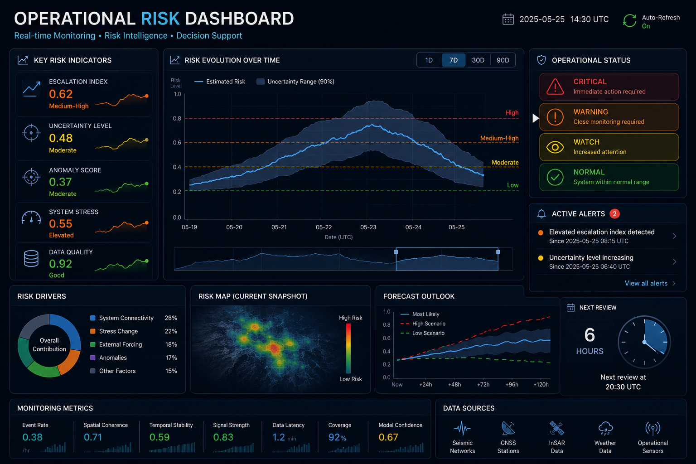

# Subsurface Monitoring Visualizations

Selected conceptual visualizations illustrating monitoring indicators, system evolution, and risk interpretation in geoenergy and natural hazard systems.

This repository focuses on communicating complex subsurface observations through interpretable monitoring and decision-support visualizations.

Topics include:

- subsurface system evolution
- induced seismicity monitoring
- seismicity migration
- operational risk assessment
- uncertainty-aware monitoring
- monitoring dashboard concepts

---

## Subsurface System Evolution

Conceptual visualization illustrating how geoenergy and subsurface systems evolve through perturbation, transition, escalation, and recovery phases under uncertainty.

---

## Seismicity & Risk Evolution

Illustrative framework showing how induced seismicity and subsurface systems may evolve along multiple response trajectories depending on operational forcing, uncertainty growth, and system state.

---

## Monitoring & Decision-Support Dashboard

Conceptual monitoring dashboard illustrating interpretable indicators for subsurface monitoring, operational assessment, and risk-informed decision-making.

---

## Motivation

Many geoenergy and natural hazard systems generate large volumes of observational data, yet operational decisions often depend on a small number of interpretable indicators.

These visualizations explore how geophysical observations can be transformed into:

- monitoring indicators
- risk metrics
- uncertainty-aware assessments
- decision-support information

The objective is to bridge subsurface observations, system dynamics, and operational decision-making in complex environmental systems.
