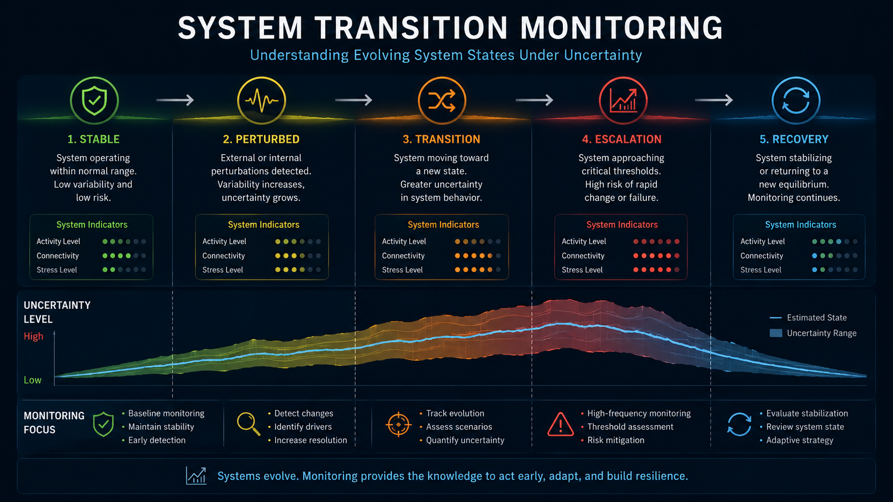
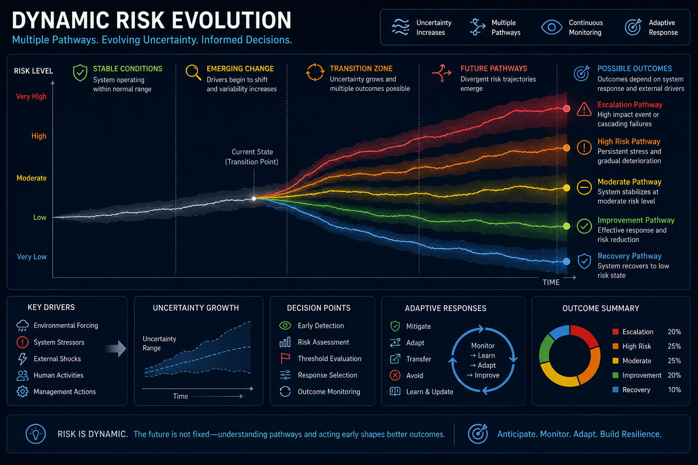

# Environmental Intelligence Visuals

Selected conceptual visualizations related to environmental risk analytics, uncertainty quantification, and evolving system behaviour.

This repository focuses on decision-oriented visual communication across environmental, infrastructure, and monitoring systems.

Topics include:

- system transitions
- operational risk evolution
- uncertainty-aware monitoring
- environmental intelligence
- resilience and escalation pathways
- monitoring dashboard concepts

---

## System Transition Monitoring

Conceptual visualization illustrating how environmental and operational systems evolve through perturbation, transition, escalation, and recovery phases under uncertainty.

## Dynamic Risk Evolution

Illustrative framework showing how complex systems may evolve along multiple risk trajectories depending on uncertainty growth, external forcing, and adaptive responses.

